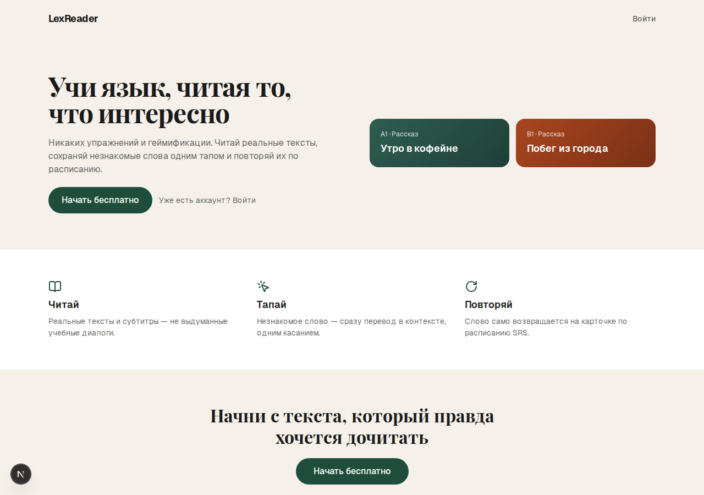
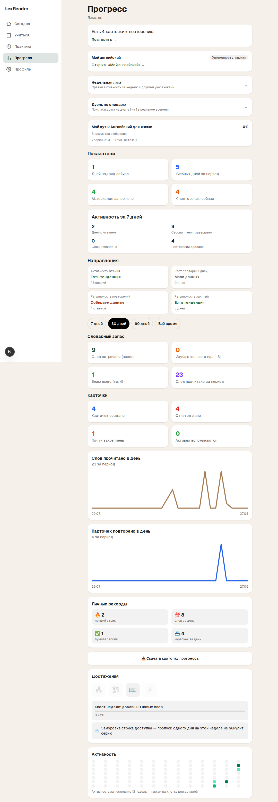
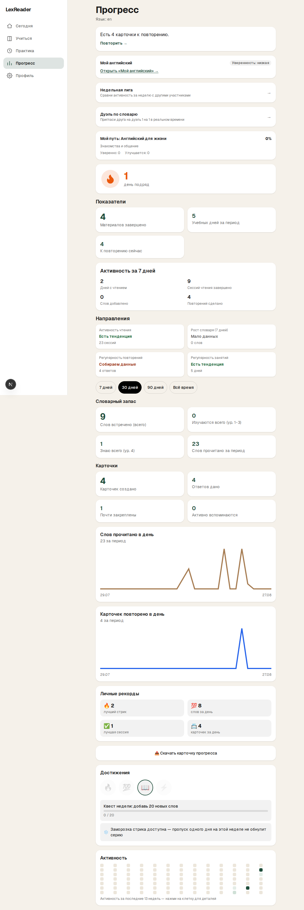
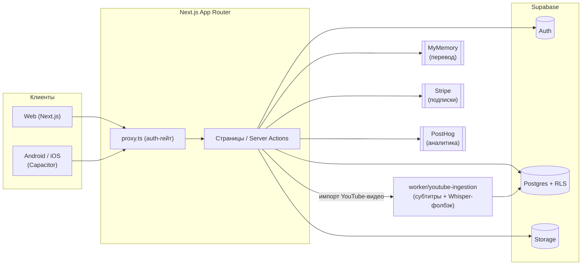

# LexReader

Приложение для изучения языка через чтение реальных текстов: читаешь → тапаешь непонятное слово → получаешь перевод в контексте → сохраняешь в свой словарь → повторяешь по расписанию SRS.

**Живая версия:** [lexreader.vercel.app](https://lexreader.vercel.app)

Полное ТЗ: [lexpring-clone-spec.md](./lexpring-clone-spec.md).

## Скриншоты

|                                                       Было                                                       |                                                      Стало                                                      |
| :---------------------------------------------------------------------------------------------------------------: | :----------------------------------------------------------------------------------------------------------------: |
|  |  |
|  |  |

Больше живых скриншотов ключевых экранов (десктоп + мобилка) — в [финальной визуальной проверке](./docs/release-2026-08-26/13_FINALNAYA_PROVERKA_2026-08-27.md).

## Стек

- **Frontend**: Next.js (App Router) + React + Tailwind CSS
- **Backend/БД/Auth**: Supabase (Postgres + Auth + Storage), Row Level Security по `owner_id = auth.uid()`
- **Перевод**: MyMemory API (бесплатно, без ключа) через `src/lib/translate.ts` — абстракция, легко заменить на LibreTranslate (self-hosted) или DeepL позже
- **SRS**: два алгоритма планирования интервалов повторения бок о бок, за фиче-флагом (`src/lib/fsrs-flags.ts`):
  - **FSRS** (`src/lib/fsrs.ts`) — адаптер поверх [`ts-fsrs`](https://github.com/open-spaced-repetition/ts-fsrs), современный алгоритм с явной моделью «стабильность/сложность» вместо эвристик; целевой алгоритм для новых карточек.
  - **SM-2** (`src/lib/srs.ts`) — упрощённая 4-балльная реализация классического алгоритма, legacy-путь для карточек, заведённых до перехода на FSRS, и фолбэк, пока флаг не включён для аккаунта.
- **Аналитика**: PostHog
- **Платежи**: Stripe (см. `src/app/api/webhooks/stripe/`)
- **Импорт материалов**: PDF (`pdfjs-dist`), фото/OCR (`tesseract.js`), веб-статьи (`@mozilla/readability`), YouTube-субтитры + Whisper-фолбэк (`worker/youtube-ingestion/`, отдельный воркер)
- **Мобильные обёртки**: Capacitor (Android/iOS) поверх того же Next.js-приложения

## Архитектура



Читалка, словарь (Мозг/Тетрадь), повторение по SRS и экран прогресса — это server actions и server components внутри `src/app/(app)/`; авторизация проверяется в `src/proxy.ts` (Next.js 16 переименовал Middleware в Proxy) на каждый запрос к защищённым маршрутам. Вся запись/чтение данных идёт через Supabase с RLS-политиками `owner_id = auth.uid()` — база данных сама фильтрует строки на своём уровне, приложению не нужен отдельный слой авторизации поверх запросов.

## Разработка

```bash
npm run dev
```

Открыть [http://localhost:3000](http://localhost:3000).

### Supabase

1. Создать проект на [supabase.com](https://supabase.com) (или поднять локально через `npx supabase start`).
2. Скопировать `.env.local.example` в `.env.local` и заполнить ключи.
3. Применить миграции из `supabase/migrations/` через Supabase Studio (SQL Editor) или `npx supabase db push`.

### Проверки перед коммитом

```bash
npm run typecheck
npm run lint
npm test          # 403 unit/integration-теста, самодостаточные, без БД
npm run test:e2e  # Playwright, требует поднятый Supabase + dev-сервер
```

## Порядок реализации (см. раздел 13 ТЗ)

Исходный MVP-план проекта — все 7 пунктов давно реализованы, раздел оставлен как историческая справка:

1. Схема БД + RLS
2. Онбординг → `profiles`
3. Читалка с tap-to-translate (критический путь)
4. Словарь (notebook) + сохранение слов
5. SRS-очередь и сессия повторения
6. Экран прогресса
7. Paywall и подписки
